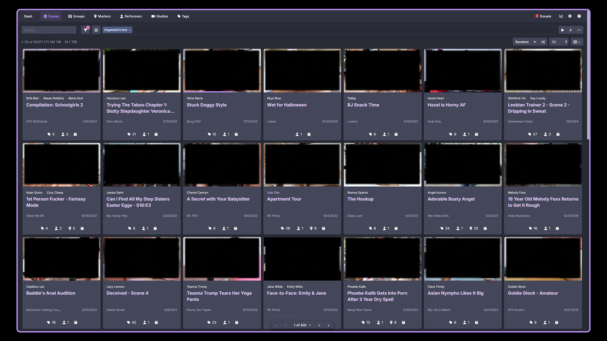

# Dracula for Stash

> A dark theme for [Stash](https://stashapp.cc) based on the [Dracula](https://draculatheme.com) theme.

&nbsp;

## Installation

1. Navigate to Settings > Plugins inside Stash.
2. In the **Available Sources** section, click `Add Source`.
3. Enter "Dracula Theme" in the **Name** field
4. Paste the following link in the **Source URL** field: https://uncertainmongoose.github.io/dracula-for-stash/index.yml
5. Open the newly created plugin dropdown, check the box next to the theme, and click `Install`
6. Disable any *other* active themes
7. Reload the browser window
8. Done 🎉

&nbsp;

## Team

This theme was created by the following person based on the work of a bunch of all the [awesome Dracula Theme contributors](https://github.com/dracula/foobar/graphs/contributors).

|  |
| -------------------------------------------------------------------------------------------------------- |
| [UncertainMongoose](https://github.com/uncertainmongoose)                                                |

&nbsp;

## To-Do List

- [ ] **Tag Grid:** Make the `Toggle Favorite` (heart) button the top "layer"
- [ ] **Tag Page:** Increase space between a Tag's description and parent/child tag lists
- [ ] **Tag Page:** Decrease space between paragraph and ordered/unordered lists
- [X] **Tagger:** Increase width of tagger video description tooltip
- [X] **Repo:** Update README UI preview screenshot
- [X] **Tagger:** Fix broken tag styling in tagger/edit views
- [X] **Text Fields:** Improve text field clear button styling

&nbsp;

## The Dracula Community

- [Twitter](https://twitter.com/draculatheme) - Best for getting updates about themes and new stuff.
- [GitHub](https://github.com/dracula/dracula-theme/discussions) - Best for asking questions and discussing issues.
- [Discord](https://draculatheme.com/discord-invite) - Best for hanging out with the community.
